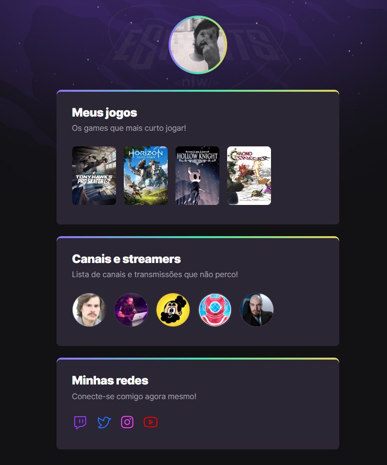

# NLW eSports - 

>Trilha Explorer

Projeto construído do evento Next Level Week da Rocketseat.

🔗 [Clique aqui para acessar](https://luistomasini.github.io/nlw-esports-explorer)

Desafio proposto

🔗 [Clique aqui para acessar](https://luistomasini.github.io/nlw-esports-explorer/desafio)

## 🚀 Tecnologias

- HTML
- CSS
- Git e Github

## O que aprendi

- HTML
  - estruturação do HTML:  `<HTML> <head> <body>`
  - tags: `<main> <section> 
  <a> <ul> <li>`
  - classes e ids
  - link stylesheet css
  - conceito de pai e filho

- CSS
  - conceitos básicos: seletores, declaração, propriedade e valor
  - ordem de prioridade
  - flexbox
  - animações
  - pseudoelementos

- Git e Github
  - Conceitos básicos
  - Upload e hospedagem da página
  - Personalização do README.md

## 📱 Contato

- email: <a href="mailto:luis_tomasini20@hotmail.com">luis_tomasini20@hotmail.com</a>
- instagram: <a href="https://www.instagram.com/leatles2/">@leatles2</a>
- linkedin: <a href="https://www.linkedin.com/in/luis-paulo-tomasini-503474234/">Luis Paulo Tomasini</a>
- facebook: <a href="https://www.facebook.com/luis.tomasini.7/">luis.tomasini.7</a>
- icq: 19876890
- msn: Hellraiser_16
- orkut: Luis Tomasini
- sinal de fumaça também.
